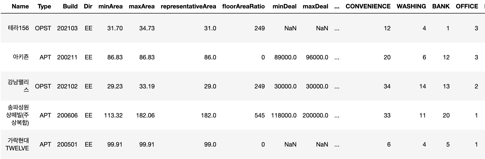
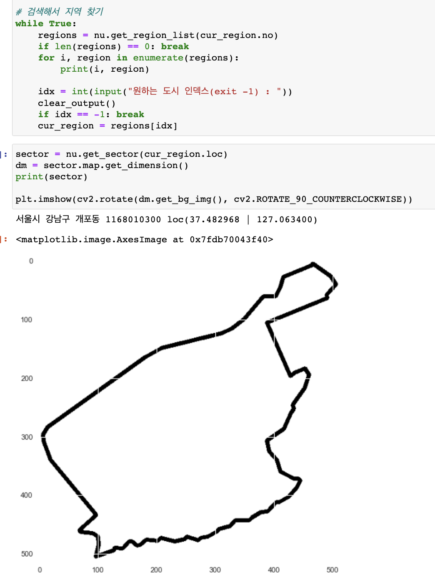
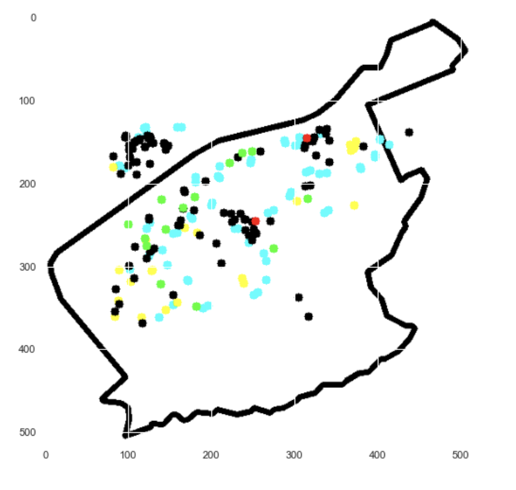
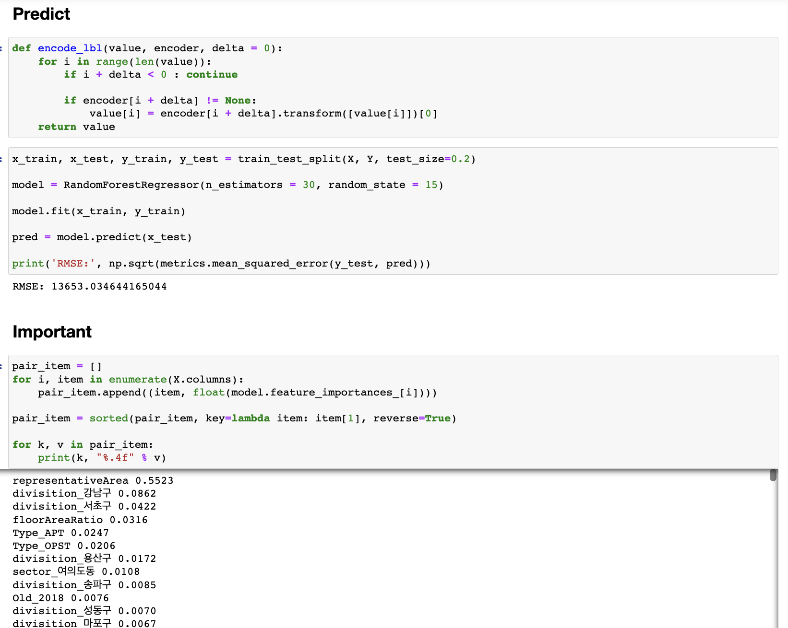
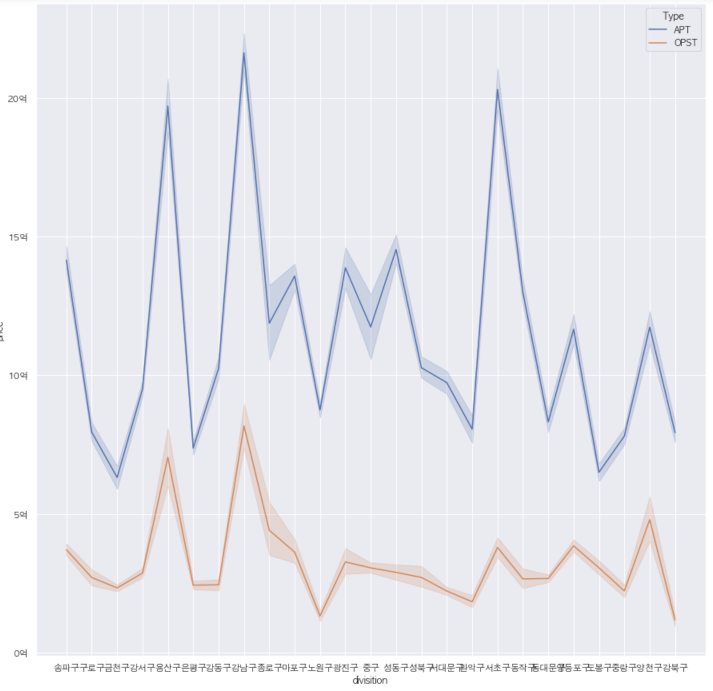
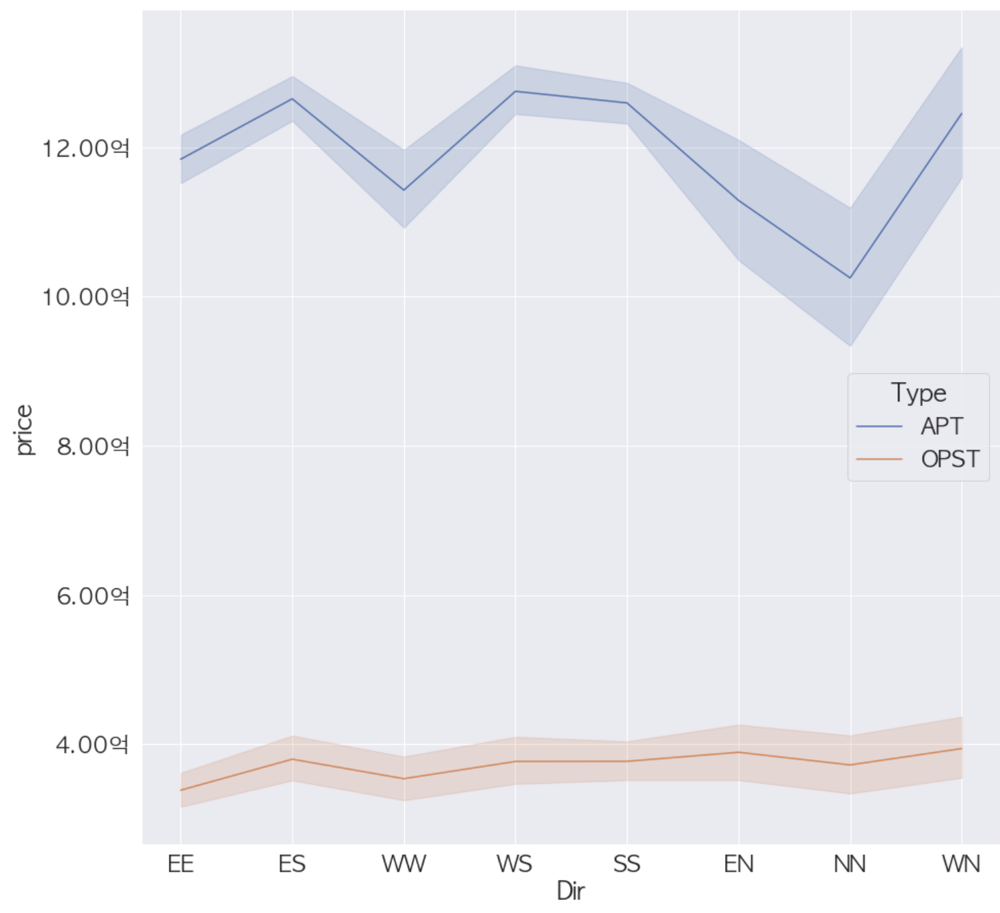

# 네이버 아파트 부동산 가격 AI

---

## 개요

---

Boston House 의 영감을 받아 만들었음.

1. Kind of Feature
2. Nave 부동산 지도 Crawling (공식 API 없음, 직접 만듦)
3. Training

### 1. Kind of Feature

- Name: 아파트 이름
- Type: OPST(오피스텔) or APT(아파트)
- Build: 준공 연월
- Dir: 방향
- minArea: 아파트 최소 면적
- maxArea: 아파트 최대 면적
- representativeArea: 실제 면적
- floorAreaRatio: 용적률
- minDeal: 최소 가격
- maxDeal: 최대 가격
- sector: 동
- divisition: 구
- PUB_SCHOOL: 공립 학교 수
- PRI_SCHOOL: 사립 학교 수
- BUS: 버스 정류장 수
- METRO: 지하철 수
- INFANT/PRESCHOOL: 유치원 수
- HOSPITAL: 병원 수
- PARING: 주차장 수
- MART: 마트 수
- CONVENIENCE: 편의점 수
- OFFICE: 관공서 수

### 2. Crawling

---

!!! 네이버 부동산은 관련 API 를 공식적으로 제공하지 않는다. 따라서 개발자 도구를 통해 내부 API 호출을 직접 확인, 테스트를 거쳐서 관련 라이브러리를 만들었음. (nre 폴더 참조)

#### 데이터 신뢰성

크롤링 라이브러리를 직접 만들어서 네이버 부동산에 '서울' 내의 매물의 평균을 확인한 결과, 약 14억 정도 였다. (서울 내 아파트 가격 평균 가격의 기사를 확인해 봤을때, 12~14억 사이) 로 어느 정도 신뢰성이 있다.

#### 클래스 역할

- NAddon: 내부 API 호출에 필요한 조건 생성
- NThing: csv 생성에 필요한 레코드 정보
- NLocation: 위도/경도 데이터 저장 및 변환
- NMap: 위치 배열을 바탕으로 지도 생성
- NDust: 위도/경도 해당하는 점
- NDimension: NMap과 cv2를 이용하여 지도 이미지 생성
- NSector: sector 위치, 이름 등 데이터
- NRE_ROUTER: 요청에 따른 라우팅(path 상수 관리)
- NNeighborAround: Sector 주변의 편의시설 데이터
- NNeighbor: 편의시설
- NArea: 면적(최소, 최대)
- NPrice: 가격(최소, 최대, 평균)

#### 사용한 외부 라이브러리

- haversine: 위도/경도 계산
- numpy: 위도/경도 계산 편의
- cv2: Polygon을 이미지로 변환
- shapely: 좌표를 이용한 Polygon 생성

#### 맵 이미지 생성

### 3. Train

---

#### 편의 시설 데이터 선택

보통 5~10 분 거리에 편의 시설이 있다면, 역세권 등 (~ 권)으로 말한다. 따라서 두 지점 사이의 거리가 500m 이내라면 해당 편의 시설이 존재하는 것으로 카운팅 했다.

#### one-hot encoding 이용한 이유

divisition 및 sector 는 ML의 편의를 위해 숫자로 변환되는데, 이때 숫자 간의 대소 관계가 생성된다. 이는 잠재적으로 ML에 영향을 줄 수 있기 때문에 one-hot encoding을 선택했다.

#### 이상치 제거

MinMaxScalar를 이용했고, 그 전에 Outlier는 IQR을 이용하여 제거해 주었다.

#### random-forest-degression, K-Fold

의사 결정 트리와 비교하면서 고민을 한 결과, 위 알고리즘이 성능이 좋아 이를 선택했음. 다만 두 경우 모두 over fit 되는 문제가 있었음.

그래도 K-Fold 방법 등을 이용하여 최대한 해결하고자 했다.

### 그래서 성능은?

상당히 뼈 아픈 문제이다. boston house 에서 영감을 받고 국내 서울 자료를 만들어보자! 해서 시작했는데. feature 선택에 실수가 있었다. 역세권, 교육 등 편의시설에 매몰된 나머지 다른 수치들을 신경 보지 않았던 것이다. 사실 서울 내에 500m 이내에 편의 시설이 없는 경우를 보기 드물다. 이로 인해 각 매물들의 분류가 명확히 되지 않았다.

다만 divisition, sector, dir에 따른 가격 차이는 확연히 볼 수 있었다.

- 최대 : 강남구, 서초구
- 최소 : 도봉구, 금천구

